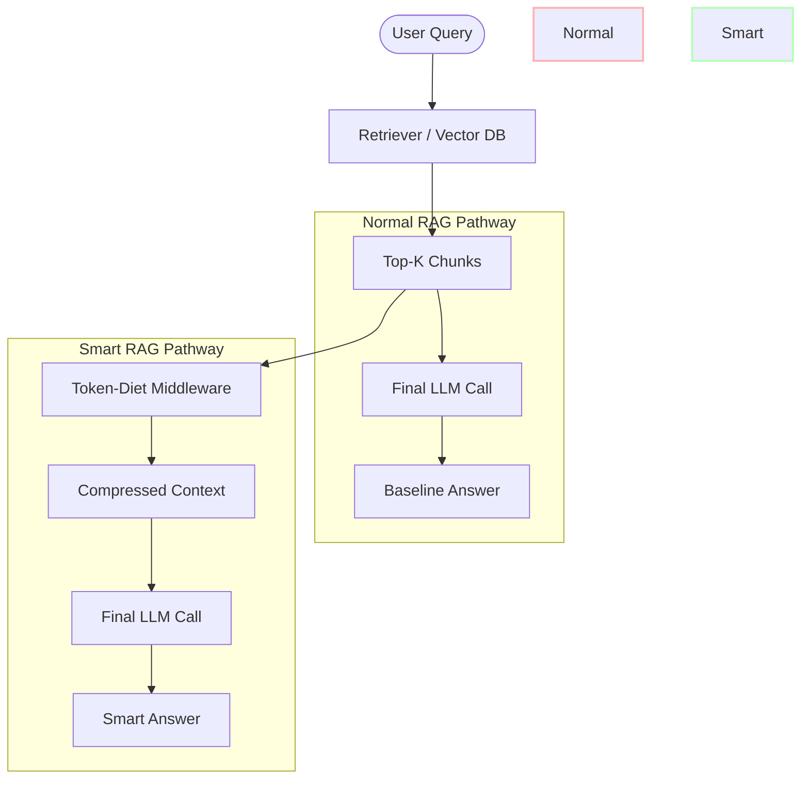
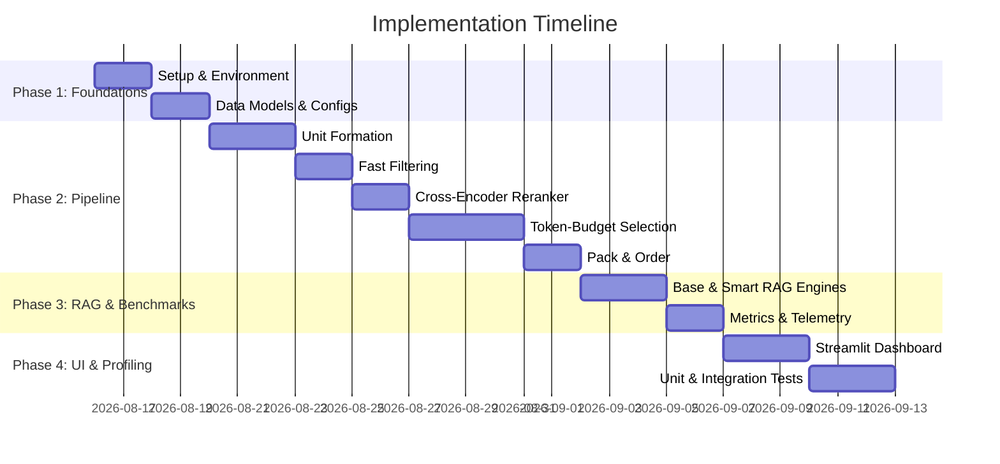

# Implementation Plan - Token-Diet Dynamic Context Compressor

The **Token-Diet Dynamic Context Compressor** is a post-retrieval optimization pipeline designed to sit between the retrieval and generation phases of a Retrieval-Augmented Generation (RAG) system. Its primary goal is to strip out filler words, redundant sentences, and irrelevant paragraphs from retrieved documents, passing only dense, highly relevant semantic content to the LLM.

This document outlines the complete technical design, data structures, and step-by-step implementation phases.

---

## 1. Project Objective and Scope

### Objective
To reduce downstream Large Language Model (LLM) prompt processing overhead (Time-to-First-Token) and associated API costs by dynamically compressing retrieved context chunks, while minimizing answer quality degradation and maximizing end-to-end latency savings.

### Scope
- **In-Scope**: Pipeline middleware that ingests retrieved text chunks, segments them into sentence-level (prose) or block-level (structured) units, filters candidates using BM25 and embedding similarity, reranks them using a local Cross-Encoder (with surrounding context windows), selects them using a strict global token budget (with similarity-based redundancy filtering and context restoration), and packs them.
- **Out-of-Scope**: Modifications to the baseline retriever or vector database structure, query rewriting, hybrid retrieval, reciprocal rank fusion (RRF), semantic caching, or using a generative LLM for compression or preprocessing.

---

## 2. Explicit System Boundary

The system boundary is strictly defined to isolate the compressor middleware. Both the baseline (Normal RAG) and optimized (Smart RAG) paths share identical inputs, retrievers, vector databases, query sets, and final LLM generation settings.



---

## 3. Final Architecture

The compressor middleware consists of five sequential pipeline stages running locally:


---

## 4. Component-by-Component Explanation

### Stage 1: Structure / Context Unit Formation
- **Purpose**: Parse raw paragraph chunks into fine-grained, context-aware units (`ContextUnit`) to allow precise scoring.
- **Prose Parsing**: Split text into individual sentences using a sentence tokenizer. For each sentence, a `target_text` (the sentence itself) and a `scoring_text` (the sentence plus a small local context window of ±1 sentence) are generated to prevent scoring in isolation.
- **Structured Parsing**: Identify code blocks, tables, and JSON using syntax markers and extract them as **logical structure-preserving units** (e.g., a function block, a sub-object, or a subset of table rows with headers prepended) rather than giant, indivisible 2,000-token blocks.
  - *Fallback Handling*: If structured parsing fails due to malformed syntax, the parser falls back to treating the block as plain prose rather than crashing the pipeline.
- **Metadata Tagging & Precomputation**: Attach positions, chunk IDs, parent chunk IDs, and token counts to each unit. Run the exact tokenizer once on the `target_text` of each unit during this stage, storing the result in `ContextUnit.token_count`.

### Stage 2: Fast Relevance Filter
- **Purpose**: Low-latency candidate-generation stage to reduce candidate units from hundreds down to a configurable pool (e.g., $M = 50$ candidates) before running the heavier reranker.
- **Implementation**: Apply a lightweight lexical relevance score (such as BM25) combined with fast cosine similarity scores from a lightweight embedding model.
  - BM25 is applied only as a lightweight post-retrieval candidate filter over the current query's retrieved units.
  - The retrieved units function as the corpus for this filtering operation.
  - The baseline retriever and vector database remain completely unchanged.
  - The implementation should avoid unnecessary repeated BM25 index construction within the same request (e.g., building the index once for the current query context) and benchmark the overhead.

### Stage 3: Batched Cross-Encoder Reranking
- **Purpose**: Generate high-accuracy relevance scores for candidate units.
- **Implementation**: Pair the query with each candidate's `scoring_text` to resolve context-dependent pronouns (the "context vacuum" problem). Score the pairs using a local Transformer-based Cross-Encoder via structured, batched inference rather than sequential loops.

### Stage 4: Smart Token-Budgeted Selection
- **Purpose**: Select the best subset of units that fits within a strict global token budget, while removing redundancy and restoring adjacent sentences for context coherence.
- **Implementation**: Run a greedy, relevance-first selection process. Precomputed exact unit token counts are used during the performance-sensitive selection loop, while lightweight estimates are used only for formatting/header overhead. Exact tokenization of the complete packed context is used for final budget validation:
  - Candidates are evaluated in descending order of Cross-Encoder score.
  - Incremental cost calculations are run inside the loop using the precomputed `ContextUnit.token_count` values and markdown header estimates to avoid full context string generation and tokenizer execution on each candidate.
  - When the selection loop concludes, the final context is assembled and exactly tokenized. If the hard budget invariant is breached, priority-aware shrinking iteratively removes the lowest-scoring units.

### Stage 5: Pack & Order Context
- **Purpose**: Reassemble selected units into a valid, optimized Markdown block.
- **Implementation**: Sort selected units by their original document order to preserve narrative flow, group items under markdown headers by source document, and normalize whitespace.

---

## 5. Data Flow

```
[Raw Documents] -> [Vector DB]
                      |
                 (Top-K Chunks)
                      v
        +----------------------------+
        |   1. Unit Formation        | -> Generates target_text & scoring_text (Precomputes token_count)
        +----------------------------+
                      v
        +----------------------------+
        |   2. Fast Relevance Filter | -> Filters to top-M candidates
        +----------------------------+
                      v
        +----------------------------+
        |   3. Cross-Encoder Rerank  | -> Scores candidates using scoring_text
        +----------------------------+
                      v
        +----------------------------+
        |   4. Budget Selection      | -> Incremental sum of precomputed token_count & final exact validation
        +----------------------------+
                      v
        +----------------------------+
        |   5. Pack & Order          | -> Re-orders and formats final prompt payload
        +----------------------------+
                      v
               (Compressed Prompt)
                      v
               [Final LLM Call]
```

---

## 6. Recommended Tech Stack

- **Language**: Python 3.10+ (standard for data science and ML pipelines).
- **Sentence Segmentation**: `nltk` (specifically `nltk.tokenize.sent_tokenize`) or `spaCy` (for fast, accurate sentence parsing).
- **Embeddings & Cross-Encoder**: `sentence-transformers` library (leveraging PyTorch/Hugging Face).
  - *Embedding model for fast filtering*: `all-MiniLM-L6-v2` (384-dimensional, highly performant).
  - *Cross-Encoder model*: `cross-encoder/ms-marco-MiniLM-L-6-v2`.
- **Lexical Filter**: `rank_bm25` (lightweight, zero-config BM25 implementation).
- **Token Counting**: `tiktoken` (exact match for OpenAI tokenization models) or `transformers.AutoTokenizer` (for open-source local LLMs).
- **Vector DB**: In-memory `faiss-cpu` or a simple NumPy-based matrix for local execution.
- **Final LLM Interaction**: `openai` (for cloud APIs) and `requests`/`litellm` (for local Ollama/Llama.cpp endpoints supporting streaming).
- **Dashboard / Visualization**: `streamlit` (for rapid development of interactive comparative dashboards).

---

## 7. Repository/Project Folder Structure

```
token-diet-compressor/
│
├── config/
│   └── default_config.yaml     # System configurations (budgets, thresholds, paths)
│
├── src/
│   ├── __init__.py
│   ├── config.py               # YAML configuration loader
│   ├── models.py               # Dataclasses and Pydantic validation schemas
│   ├── database.py             # In-memory document indexing & baseline vector search
│   ├── normal_rag.py           # Baseline RAG workflow (Retriever -> LLM)
│   ├── smart_rag.py            # Optimized RAG workflow (Retriever -> Compressor -> LLM)
│   │
│   ├── pipeline/
│   │   ├── __init__.py
│   │   ├── unit_formation.py   # Prose & structured logical unit parsing
│   │   ├── fast_filter.py      # BM25 & Embedding pre-filtering
│   │   ├── reranker.py         # Batched Cross-Encoder inference using scoring_text
│   │   ├── selector.py         # Precomputed cost summation & exact budget validation
│   │   └── packer.py           # Reordering and formatting
│   │
│   └── evaluation.py           # Benchmarking execution engine and metrics calculation
│
├── tests/
│   ├── __init__.py
│   ├── test_unit_formation.py
│   ├── test_fast_filter.py
│   ├── test_selector.py
│   └── test_integration.py
│
├── app.py                      # Streamlit dashboard application
├── requirements.txt            # Python package dependencies
└── README.md                   # Setup and usage instructions
```

---

## 8. Data Models and Classes

We define robust schemas in [models.py](file:///C:/Users/Lenovo/.gemini/antigravity/scratch/token-diet-compressor/src/models.py) to pass items through the pipeline:

```python
from dataclasses import dataclass, field
from typing import List, Dict, Any, Optional

@dataclass
class ContextUnit:
    unit_id: str             # Format: {doc_id}_{chunk_id}_{unit_idx}
    doc_id: str
    chunk_id: str
    target_text: str         # The actual sentence or logical structured block to be evaluated and selected
    scoring_text: str        # The target text + surrounding context (prose or structured) for Cross-Encoder scoring
    unit_type: str           # "prose" | "structured"
    position_idx: int        # 0-indexed position within its parent chunk
    parent_chunk_id: str
    token_count: int = 0     # Precomputed exact token count of target_text (computed once in Stage 1)
    embedding: Optional[List[float]] = None

@dataclass
class ScoredCandidate:
    unit: ContextUnit
    lexical_score: float = 0.0
    embedding_score: float = 0.0
    rerank_score: float = 0.0
    final_score: float = 0.0

@dataclass
class CompressorOutput:
    compressed_text: str
    selected_units: List[ContextUnit]
    metrics: Dict[str, Any]
```

---

## 9. Configuration Parameters

Configurations are managed via a YAML file (`config/default_config.yaml`):

```yaml
system:
  seed: 42
  device: "cpu" # "cpu" or "cuda"

retriever:
  top_k: 5 # number of document chunks to retrieve

compressor:
  global_token_budget: 800  # maximum tokens for LLM context (invariant cap)
  sentence_tokenizer: "nltk"
  
  # Stage 2: Fast Filter
  fast_filter_candidate_limit: 50 # M candidates
  bm25_weight: 0.5
  embedding_weight: 0.5
  
  # Stage 3: Cross-Encoder
  cross_encoder_model: "cross-encoder/ms-marco-MiniLM-L-6-v2"
  cross_encoder_batch_size: 32
  
  # Stage 4: Selection
  restoration_window_left: 1  # restore N sentences to the left
  restoration_window_right: 1 # restore N sentences to the right
  similarity_threshold: 0.8 # similarity-based redundancy filter threshold
  
llm:
  provider: "openai" # "openai" or "ollama"
  model: "gpt-4o-mini"
  temperature: 0.0
  max_tokens: 500
```

---

## 10. Step-by-Step Implementation Phases



---

## 11. Pseudocode for the Core Compression Pipeline

```python
def compress_context(query: str, retrieved_chunks: List[Dict[str, Any]], config: Dict[str, Any]) -> CompressorOutput:
    # Start timer
    t_start = time.perf_counter()
    
    # 1. Structure / Context Unit Formation (Precomputes ContextUnit.token_count)
    units, parent_chunks = form_context_units(retrieved_chunks, config)
    t_units = time.perf_counter()
    
    # 2. Fast Relevance Filter (Reduce to M candidates)
    candidates = fast_filter_candidates(query, units, config)
    t_filter = time.perf_counter()
    
    # 3. Batched Cross-Encoder Reranking (Using scoring_text)
    scored_candidates = rerank_candidates(query, candidates, config)
    t_rerank = time.perf_counter()
    
    # 4. Greedy Token-Budgeted Selection (Using precomputed target_text token_count, restoring window)
    selected_units = select_budgeted_candidates(query, scored_candidates, parent_chunks, config)
    t_select = time.perf_counter()
    
    # 5. Pack & Order Context
    compressed_text = pack_and_order_context(selected_units, parent_chunks)
    t_pack = time.perf_counter()
    
    # Calculate Latencies
    t_end = time.perf_counter()
    metrics = {
        "unit_formation_ms": (t_units - t_start) * 1000,
        "fast_filter_ms": (t_filter - t_units) * 1000,
        "rerank_ms": (t_rerank - t_filter) * 1000,
        "selection_ms": (t_select - t_rerank) * 1000,
        "pack_ms": (t_pack - t_select) * 1000,
        "total_compressor_ms": (t_end - t_start) * 1000,
        "original_token_count": count_tokens(" ".join([c["text"] for c in retrieved_chunks])),
        "compressed_token_count": count_tokens(compressed_text)
    }
    
    return CompressorOutput(
        compressed_text=compressed_text,
        selected_units=selected_units,
        metrics=metrics
    )
```

---

## 12. Cross-Encoder Batching Strategy

To resolve the context vacuum problem, we construct pairs utilizing each candidate's `scoring_text` (which preserves nearby sentences for context-dependent prose). Inference is executed in structured batches to minimize latency overhead.

```python
def rerank_candidates(query: str, candidates: List[ContextUnit], config: Dict[str, Any]) -> List[ScoredCandidate]:
    if not candidates:
        return []
        
    # Load model (cached)
    model = get_cross_encoder_model(config["cross_encoder_model"], device=config["device"])
    
    # Form pairs using scoring_text (target + local context window)
    pairs = [[query, cand.scoring_text] for cand in candidates]
    
    # Run batched inference
    scores = model.predict(
        pairs, 
        batch_size=config["cross_encoder_batch_size"], 
        show_progress_bar=False,
        convert_to_numpy=True
    )
    
    # Construct scored structures
    scored = []
    for cand, score in zip(candidates, scores):
        scored.append(ScoredCandidate(unit=cand, rerank_score=float(score)))
        
    # Sort descending by score
    scored.sort(key=lambda x: x.rerank_score, reverse=True)
    return scored
```

---

## 13. Greedy Token-Budgeted Selection

The selection algorithm uses a greedy approach that enforces the strict global token budget. It leverages precomputed token counts (`ContextUnit.token_count`) and incremental summation to avoid tokenizer calls inside the loop, performing a single exact verification and priority-aware shrinking fallback at the end.

```python
def select_budgeted_candidates(
    query: str, 
    candidates: List[ScoredCandidate], 
    parent_chunks: Dict[str, List[ContextUnit]], 
    config: Dict[str, Any]
) -> List[ContextUnit]:
    
    global_budget = config["global_token_budget"]
    w_left = config["restoration_window_left"]
    w_right = config["restoration_window_right"]
    
    selected_units: List[ContextUnit] = []
    selected_indices_by_chunk = defaultdict(set)
    unit_priorities: Dict[str, float] = {}
    
    # Fast Incremental Token Cost Estimation Variables (O(1) lookups)
    estimated_total_tokens = 0
    
    # 1. Evaluate Candidates in Priority Order
    for cand_wrapper in candidates:
        candidate = cand_wrapper.unit
        chunk_id = candidate.parent_chunk_id
        pos_idx = candidate.position_idx
        
        # 2. Similarity-based Redundancy Removal
        if is_redundant(candidate, selected_units, config):
            continue
            
        # 3. Determine the Complete Restored Representation
        sibling_units = parent_chunks[chunk_id]
        if candidate.unit_type == "prose":
            start_idx = max(0, pos_idx - w_left)
            end_idx = min(len(sibling_units) - 1, pos_idx + w_right)
        else:
            start_idx = pos_idx
            end_idx = pos_idx
        
        proposed_indices = set(range(start_idx, end_idx + 1))
        current_indices = selected_indices_by_chunk[chunk_id]
        
        new_indices = proposed_indices - current_indices
        if not new_indices:
            continue
            
        # 4. Calculate O(1) Incremental Estimated Token Cost via Helper
        net_new_tokens = calculate_net_token_increase(
            chunk_id, 
            sibling_units, 
            current_indices, 
            proposed_indices, 
            config
        )
            
        # 5. Greedy Selection utilizing Precomputed Token Cost Sums
        if estimated_total_tokens + net_new_tokens <= global_budget:
            # Commit selection to indices
            selected_indices_by_chunk[chunk_id].update(proposed_indices)
            
            # Add new units to selected list
            for idx in new_indices:
                u = sibling_units[idx]
                selected_units.append(u)
                unit_priorities[u.unit_id] = cand_wrapper.rerank_score
                
            # Update running estimate
            estimated_total_tokens += net_new_tokens
        # 6. Otherwise skip and continue
        
    # --- Safe Fallback Handling ---
    # If no candidate survived, select highest-priority units that fit estimated cost
    if not selected_units and candidates:
        for cand_wrapper in candidates:
            candidate = cand_wrapper.unit
            est_cost = calculate_net_token_increase(candidate.parent_chunk_id, parent_chunks[candidate.parent_chunk_id], set(), {candidate.position_idx}, config)
            if est_cost <= global_budget:
                selected_units = [candidate]
                unit_priorities[candidate.unit_id] = cand_wrapper.rerank_score
                break
                
    # 7. Exact Verification (Called exactly ONCE on the final packed prompt)
    final_packed = pack_and_order_context(selected_units, parent_chunks)
    final_token_count = count_tokens_fn(final_packed)
    
    # Priority-Aware removal fallback (Only runs if estimate under-estimated actual count)
    while final_token_count > global_budget and selected_units:
        # Find selected unit with the lowest priority/relevance score
        lowest_unit = min(selected_units, key=lambda u: unit_priorities.get(u.unit_id, -float('inf')))
        selected_units.remove(lowest_unit)
        
        # Rebuild and run exact tokenization
        final_packed = pack_and_order_context(selected_units, parent_chunks)
        final_token_count = count_tokens_fn(final_packed)
        
    assert final_token_count <= global_budget, "Hard token budget violated"
    return selected_units
```

---

## 14. Context Restoration Logic

Context restoration prevents the context vacuum issue. Overlapping restorations are merged dynamically by indexing selected units inside their parent chunks. To minimize tokenizer overhead, incremental calculations are executed mathematically using precomputed target token counts instead of running tokenizer commands on candidate strings inside the greedy loop.

```python
def calculate_net_token_increase(
    chunk_id: str, 
    sibling_units: List[ContextUnit], 
    current_indices: set, 
    proposed_indices: set, 
    config: Dict[str, Any]
) -> int:
    
    header_overhead_tokens = 15  # Constant approximation for markdown header formatting
    
    # 1. Determine which unit indices are newly introduced by the proposed restoration
    new_indices = proposed_indices - current_indices
    
    # 2. Sum the precomputed target token_count values of those new units
    net_tokens = sum(sibling_units[idx].token_count for idx in new_indices)
    
    # 3. Add header overhead only if this is the first selection from this chunk
    if not current_indices:
        net_tokens += header_overhead_tokens
        
    # Incremental token cost is returned without executing any tokenizer functions on strings
    return net_tokens
```

---

## 15. Similarity-Based Redundancy Removal

To prevent packing duplicate sentences or overlapping statements, we evaluate the cosine similarity of the candidate's embedding against the embeddings of already selected units.

```python
def is_redundant(candidate: ContextUnit, selected_units: List[ContextUnit], config: Dict[str, Any]) -> bool:
    if not selected_units:
        return False
        
    threshold = config["similarity_threshold"]
    cand_emb = candidate.embedding
    if cand_emb is None:
        return False
        
    for sel in selected_units:
        if sel.embedding is None:
            continue
        # Cosine similarity calculation
        sim = cosine_similarity(cand_emb, sel.embedding)
        if sim > threshold:
            return True # Exceeds similarity limit
            
    return False
```

---

## 16. Global Token-Budget Enforcement

> [!IMPORTANT]
> **One Global Budget**: Structured candidates and prose candidates share and compete for the exact same token pool.
> **Total Payload Verification**: Token calculation must include selected target/logical units, restored neighboring units, markdown headers, and source formatting.
> **Invariant Budget Enforcement**: Under no circumstances will fallback processes or structured units bypass this budget. If necessary, a minimal or empty context is returned to maintain the cap.

---

## 17. Baseline RAG Implementation

```python
def run_baseline_rag(query: str, db_retriever: Any, llm_client: Any, config: Dict[str, Any]) -> Dict[str, Any]:
    t_start = time.perf_counter()
    
    # 1. Retrieve raw top-k paragraphs
    raw_chunks = db_retriever.retrieve(query, top_k=config["retriever"]["top_k"])
    t_retrieval = time.perf_counter()
    
    raw_context = "\n\n".join([chunk["text"] for chunk in raw_chunks])
    raw_tokens = count_tokens_fn(raw_context)
    
    prompt = f"Context:\n{raw_context}\n\nQuestion: {query}\nAnswer:"
    
    # 2. Execute LLM Call (Using streaming generator to record true TTFT)
    t_llm_start = time.perf_counter()
    response_stream = llm_client.generate_stream(prompt)
    
    ttft_time = None
    full_response = []
    
    for chunk in response_stream:
        if ttft_time is None:
            ttft_time = (time.perf_counter() - t_llm_start) * 1000
        full_response.append(chunk.text)
        
    t_end = time.perf_counter()
    
    return {
        "answer": "".join(full_response),
        "retrieval_time_ms": (t_retrieval - t_start) * 1000,
        "llm_ttft_ms": ttft_time or 0.0,
        "llm_total_gen_ms": (t_end - t_llm_start) * 1000,
        "total_time_ms": (t_end - t_start) * 1000,
        "context_tokens": raw_tokens
    }
```

---

## 18. Smart RAG Implementation

```python
def run_smart_rag(query: str, db_retriever: Any, llm_client: Any, config: Dict[str, Any]) -> Dict[str, Any]:
    t_start = time.perf_counter()
    
    # 1. Retrieve same raw top-k paragraphs
    raw_chunks = db_retriever.retrieve(query, top_k=config["retriever"]["top_k"])
    t_retrieval = time.perf_counter()
    
    # 2. Run Context Compression Middleware
    compressor_output = compress_context(query, raw_chunks, config["compressor"])
    t_compressor = time.perf_counter()
    
    prompt = f"Context:\n{compressor_output.compressed_text}\n\nQuestion: {query}\nAnswer:"
    
    # 3. Execute LLM Call (Using streaming to record true TTFT)
    t_llm_start = time.perf_counter()
    response_stream = llm_client.generate_stream(prompt)
    
    ttft_time = None
    full_response = []
    
    for chunk in response_stream:
        if ttft_time is None:
            ttft_time = (time.perf_counter() - t_llm_start) * 1000
        full_response.append(chunk.text)
        
    t_end = time.perf_counter()
    
    return {
        "answer": "".join(full_response),
        "retrieval_time_ms": (t_retrieval - t_start) * 1000,
        "compressor_time_ms": (t_compressor - t_retrieval) * 1000,
        "compressor_breakdown": compressor_output.metrics,
        "llm_ttft_ms": ttft_time or 0.0,
        "llm_total_gen_ms": (t_end - t_llm_start) * 1000,
        "total_time_ms": (t_end - t_start) * 1000,
        "original_tokens": compressor_output.metrics["original_token_count"],
        "compressed_tokens": compressor_output.metrics["compressed_token_count"]
    }
```

---

## 19. Benchmarking Methodology

To evaluate optimization gains, latency must be measured using streaming responses to expose true TTFT alongside overall generation length.

### Latency Metrics
- **Normal End-to-End Latency**:
  $$T_{\text{Normal}} = \text{Retrieval Latency} + \text{LLM TTFT}$$
- **Smart End-to-End Latency**:
  $$T_{\text{Smart}} = \text{Retrieval Latency} + T_{\text{Compressor}} + \text{LLM TTFT}$$
- **Net Latency Savings**:
  $$\Delta T = T_{\text{Normal}} - T_{\text{Smart}}$$

*Note: Total generation latency will be tracked and reported separately to compare overall pipeline output times.*

### Benchmark Experiments
The benchmark suite is split into two distinct experimental evaluations:

#### Experiment A: Compressor Effectiveness / Controlled Comparison
- **Methodology**: Ingest identical, pre-cached, and frozen retrieved document chunks for both pipelines.
- **Goal**: Isolate the compressor's performance and token compression ratio by eliminating vector database search noise and retrieval variance.

#### Experiment B: True End-to-End Performance
- **Methodology**: Execute both systems independently from query to final generation.
- **Goal**: Capture real-world execution metrics under standard deployment scenarios, measuring retrieval latency, compressor overhead, LLM TTFT, and total generation latency.

---

## 20. Evaluation Dataset/Test Cases

We compile an evaluation set of 30 queries spanning diverse scenarios to validate edge-case performance. For the evaluation dataset, we recommend pre-defining expected ground-truth facts.

### Answer Quality Evaluation Focus:
1. **Answer Correctness / Factual Accuracy (Primary Focus)**: Evaluate whether the Smart RAG answer preserves the information required to generate a correct, factually accurate response.
2. **Context Compression Ratio**: Percent reduction in context token length.
3. **End-to-End Latency**: TTFT reduction.
4. **LLM TTFT**: Fast-response time.
5. **API/Input-Token Cost**: Financial reductions.

- **Warning on Answer Cosine Similarity**: Two answers can be semantically similar while both being incorrect, or while one misses a critical factual detail. Cosine similarity will only be used as a secondary, auxiliary diagnostic metric to spot extreme semantic shifts between the pipelines.
- **No Evaluation LLM**: No secondary LLM-as-a-judge system is used. Correctness is evaluated by checking exact factual match constraints.

---

## 21. Dashboard Metrics

The Streamlit dashboard (`app.py`) will display the following metrics in order of priority:

1. **Original Retrieved-Context Tokens**: Baseline input size.
2. **Compressed-Context Tokens**: Compressed output size.
3. **Compression Percentage**: Token savings percentage.
4. **Compressor Latency**: Middleware execution time.
5. **LLM TTFT**: Time-to-First-Token comparison.
6. **End-to-End Latency**: Total user-facing latency comparison.
7. **Net Latency Savings**: Latency delta.
8. **Estimated Input-Token/API Cost**: Estimated price reduction.
9. **Answer Correctness**: Factual compliance flags.
10. **Answer Cosine Similarity**: Secondary diagnostic semantic drift check.

---

## 22. Unit Tests

We will write dedicated tests using `pytest` to verify modular correctness:

- `test_sentence_segmentation()`: Verify prose splits cleanly.
- `test_structured_logical_unit_formation()`: Ensure markdown tables, JSON objects, and code blocks are parsed into logical structure-preserving units (not giant 2,000-token single units) and tagged correctly.
- `test_context_aware_cross_encoder_input()`: Assert that prose candidate `scoring_text` includes neighboring sentences, while `target_text` contains only the target sentence.
- `test_pronoun_dependent_scoring()`: Verify pronoun resolution scoring accuracy using ±1 sentence scoring text.
- `test_fast_filter_ranking()`: Assert high BM25 query term matching candidates rank at the top.
- `test_cross_encoder_batching()`: Verify PyTorch model inference works correctly when running with batches.
- `test_similarity_based_redundancy_removal()`: Verify that duplicate sentences are removed using cosine similarity thresholds.
- `test_greedy_selection_budget()`: Verify selection stops exactly when the token count (including target text, header, and restoration overhead) exceeds the global token budget.
- `test_overlapping_restoration()`: Verify that the restoration logic merges overlapping sliding windows without duplicating lines or double-counting tokens.
- `test_priority_aware_budget_shrinking()`: Assert that when the global token budget is exceeded due to formatted context overhead, the pipeline selectively drops the lowest-priority/scoring units instead of simply popping the last appended item.
- `test_token_counting_optimization_comparison()`: Compare selection latency, final token count accuracy, and tokenizer call frequency between exact selection looping (calling tokenizer for every candidate) and optimized incremental precomputed token summation.

---

## 23. Integration Tests

- `test_end_to_end_baseline_rag()`: Verify base retriever integration.
- `test_end_to_end_smart_rag()`: Verify correct pipeline data passing (Retriever -> Compressor -> LLM).
- `test_strict_budget_enforcement()`: Pass 10,000 token documents and assert that the prompt string payload token length never exceeds 800 tokens.
- `test_structured_block_budget_competition()`: Run a mixed dataset of prose and structured units to verify both compete for the same global token budget.
- `test_empty_candidate_fallback()`: Test fallback behavior when no candidates meet filters, ensuring it does not exceed the global budget.
- `test_budget_smaller_than_candidate()`: Verify that if the global budget is smaller than any individual candidate's token size, the system returns a safe empty/minimal context.

---

## 24. Performance Profiling Plan

We will profile execution time on the target hardware to identify latency targets:
- **Profiling Tool**: Python's `cProfile` and `line_profiler`.
- **Token Optimization Profiling**:
  - Profile selection latency, total compressor latency, and number of tokenizer calls.
  - Setup a performance comparison between:
    - *Method A*: Exact tokenization inside every selection loop iteration.
    - *Method B*: Lightweight estimation (O(1) sum of precomputed unit `token_count` values and formatting overhead estimates) inside selection + single exact final validation (with priority-aware fallback shrinking).
- **Profiling Configurations**:
  - Hardware: Intel/AMD CPU (Single core) vs. CUDA GPU (if available).
  - Batch sizes: Benchmark batch sizes of 8, 16, 32, 64, and 128.
  - Candidate size ($M$): Run benchmarks with $M = 20, 50, 100, 200$.

---

## 25. Failure Handling

1. **Empty/Low-Confidence Candidate Sets**:
   - *Mitigation*: Fall back to selecting the highest-priority units that fit the budget without violating the cap.
2. **Missing Dependencies (e.g., NLTK tokenizer)**:
   - *Mitigation*: Wrap initialization in a try-except block that programmatically downloads `punkt_tab` at startup.
3. **Cross-Encoder Model Download Failure**:
   - *Mitigation*: Fall back to local paths, or fallback to pure BM25 lexical ranking if offline.
4. **Structured Parsing Fallback**:
   - *Mitigation*: If structured parsers (e.g. JSON or Markdown tables) fail due to malformed syntax, the pipeline gracefully falls back to treating the block as standard prose instead of crashing.

---

## 26. Expected Bottlenecks

- **Cross-Encoder CPU Inference**: Transformer overhead on CPU.
- **Greedy Token Counting**: Mitigated by precomputing and running incremental cost sums, leaving a single exact validation at completion.
- **JSON Parsing Overhead**: Attempting to extract structural units from malformed JSON strings.

---

## 27. Optimization Opportunities

- **Token Count Approximations**: Implemented via precomputed unit token counts and incremental header estimates to minimize tokenizer calls.
- **Model Quantization**: Convert the Cross-Encoder model to ONNX format or use dynamic range quantization (INT8) to reduce CPU execution latency.
- **Cached Embeddings**: Keep document embeddings pre-computed to avoid embedding generation during fast filtering.

---

## 28. Demo Plan

- **Preparation**: Pre-load the database with a set of technical documents (e.g., system manuals, API specs, and long code files).
- **Execution**: Run the Streamlit application.
- **Interactive UI**:
  - Enter a query.
  - Toggle the context compressor ON/OFF.
  - Review the side-by-side generated answers.
  - Examine the token budget dashboard, performance charts, and highlighted source paragraphs.

---

## 29. What to Show Judges

1. **Real-Time Latency Reduction**: Demonstrate the net latency savings using streaming TTFT.
2. **Accurate Pronoun Resolution**: Show a demo query where a pronoun-dependent sentence is successfully restored and correctly answered due to contextual scoring.
3. **Zero Budget Overflows**: Show that the context size strictly respects the budget.
4. **Structured Block Isolation**: Input a large JSON file and show that it was correctly handled without breaking.

---

## 30. Future Work

- **Adaptive Budgets**: Dynamically adjusting the token budget based on historical LLM cost and request complexity.
- **Query-Aware Restoration**: Use lightweight rules to restore context only when reference pronouns are detected.
- **Reranker ONNX Porting**: Compile to ONNX for production-level deployments.

---

## 31. Architecture Sanity Check

### Correctness
- **Cross-Encoder Vacuum**: Avoided by utilizing `scoring_text` (target + surrounding context window) in the Cross-Encoder input pairs.
- **Structured Data**: Extracted as logical, structure-preserving units (not atomic blocks), and passes through all pipeline stages. Fallbacks handle malformed blocks gracefully.
- **No Budget Fallback Bypass**: Replaced unsafe raw-chunk fallback with a budget-compliant candidate priority selector.
- **Overlap Logic**: Prevents duplicate text assembly by index tracking on a per-chunk basis.
- **Over-Budget Shrinking**: Employs priority-aware unit extraction to drop the lowest-scoring content if formatting/header overhead causes a budget breach.

### Latency
- **Cross-Encoder Batching**: Runs batch predictions to avoid execution slowdowns.
- **Model Loading**: Models are loaded once at startup and cached in memory.
- **Tokenization Performance**: Summation of precomputed exact token counts and lightweight header estimates runs inside the greedy selection loop to eliminate repeated string formatting and tokenizer iterations.
- **Total Overhead**: Complete compressor overhead is included in the net latency calculations.

### Budget
- **One Global Budget**: Prose and structured units compete for the same budget.
- **Invariant Enforcement**: The final context string is packed, checked, and asserted (`assert final_token_count <= global_token_budget`) to ensure it never exceeds the budget cap before LLM submission.

### Benchmark Fairness
- **Experiment A**: Controlled comparison using cached/frozen retrieved chunks.
- **Experiment B**: Independent end-to-end comparison from query entry to token output.
- Both systems share identical retrievers, database records, and LLM parameters.
